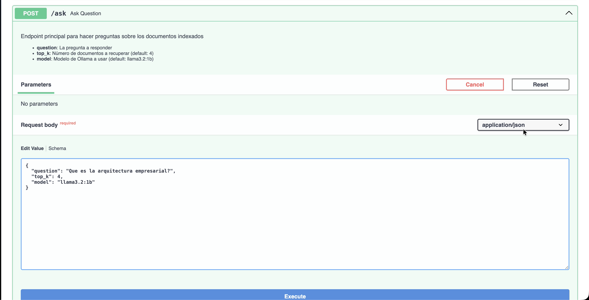
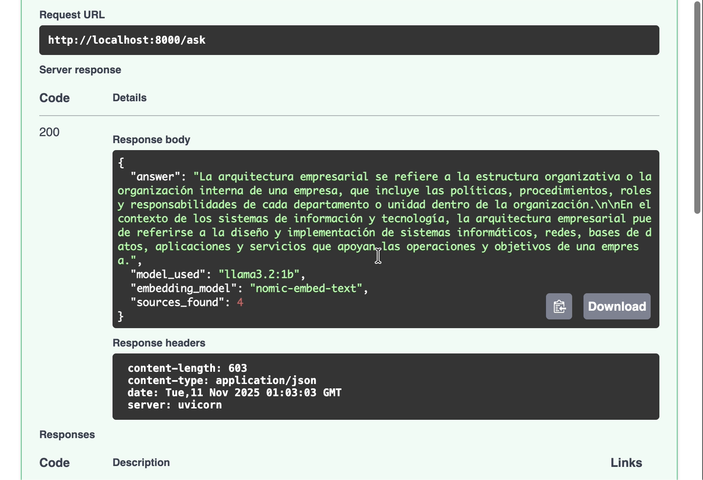

# Sistema RAG con OpenAI y Ollama

## Descripción General

Sistema de Recuperación Aumentada por Generación (RAG - Retrieval-Augmented Generation) con dos modalidades de implementación:

1. **OpenAI + Pinecone**: Implementación basada en servicios comerciales con alta calidad de respuestas
2. **Ollama + Pinecone**: Implementación local sin costos, recomendada para entornos de desarrollo y privacidad de datos

## Arquitectura del Sistema

El sistema implementa un pipeline RAG completo que incluye:

- **Módulo de Ingesta**: Procesamiento y vectorización de documentos
- **Base de Datos Vectorial**: Almacenamiento en Pinecone
- **Motor de Recuperación**: Búsqueda semántica de documentos relevantes
- **Generador de Respuestas**: LLM para síntesis de información


## Guía de Inicio Rápido (Implementación con Ollama)

### Requisitos Previos

- Python 3.9 o superior
- macOS, Linux o Windows con WSL
- 8GB RAM mínimo (16GB recomendado)
- Cuenta en Pinecone (tier gratuito disponible)

### 1. Instalación de Ollama

```bash
brew install ollama
brew services start ollama
```


### 2. Descarga de Modelos de Lenguaje

```bash
ollama pull nomic-embed-text
ollama pull llama3.2:1b
```


### 3. Configuración del Entorno Python

```bash
python -m venv .venv
source .venv/bin/activate
pip install -r requirements.txt
```

### 4. Configuración de Variables de Entorno

```bash
cp .env.example .env
# Editar .env y configurar PINECONE_API_KEY
```


### 5. Proceso de Ingesta Documental

```bash
# Colocar archivos PDF, TXT o MD en el directorio data/
python -m src.ingest_ollama
```



### 6. Modalidades de Uso

**Opción A: Interfaz de Línea de Comandos (CLI)**
```bash
python -m src.query_ollama
```


**Opción B: API REST**
```bash
uvicorn src.app_ollama:app --reload --port 8000
# Acceder a la documentación interactiva en http://localhost:8000/docs
```



## Análisis Comparativo de Implementaciones

| Característica | Implementación Ollama | Implementación OpenAI |
|----------------|----------------------|----------------------|
| **Modelo de Costos** | Sin costo operacional | Aproximadamente $0.001 por consulta |
| **Privacidad de Datos** | Procesamiento 100% local | Transmisión a servidores externos |
| **Latencia de Respuesta** | Dependiente de hardware local | Consistentemente rápida |
| **Calidad de Respuestas** | Buena (ajustable según modelo) | Excelente |
| **Requisitos de Conectividad** | No requerida (post-instalación) | Conexión constante necesaria |
| **Tiempo de Configuración** | Aproximadamente 5 minutos | Aproximadamente 2 minutos |


## Estructura del Proyecto

```
ArepRAGProject/
├── src/
│   ├── ingest.py              # Módulo de ingesta con OpenAI
│   ├── ingest_ollama.py       # Módulo de ingesta con Ollama (recomendado)
│   ├── query.py               # Sistema de consultas con OpenAI
│   ├── query_ollama.py        # Sistema de consultas con Ollama (recomendado)
│   ├── app.py                 # API REST con OpenAI
│   ├── app_ollama.py          # API REST con Ollama (recomendado)
│   ├── settings.py            # Gestión de configuración
│   ├── prompts.py             # Plantillas de prompts
│   └── resources/             # Recursos visuales y documentación
├── data/                      # Repositorio de documentos fuente
├── .env                       # Variables de entorno (no versionado)
├── .env.example              # Plantilla de configuración
├── requirements.txt           # Dependencias del proyecto
├── README.md                  # Documentación principal
├── API_USAGE.md              # Guía de uso de la API REST
└── OLLAMA_GUIDE.md           # Guía de implementación con Ollama
```

## Casos de Uso

### Aplicaciones Recomendadas

- Sistemas de asistencia basados en documentación técnica
- Búsqueda semántica en bases de conocimiento corporativas
- Asistentes conversacionales para atención al cliente
- Automatización de sistemas FAQ (Preguntas Frecuentes)
- Análisis y consulta de documentos legales, médicos o científicos

## Configuración Avanzada

### Selección de Modelo de Chat (Ollama)

Modificar en `src/query_ollama.py` o `src/app_ollama.py`:

```python
llm = OllamaLLM(model="llama3.2:3b", temperature=0)  # Mayor calidad de respuesta
```

### Ajuste de Parámetros de Recuperación

Modificar en `src/query_ollama.py`:

```python
return vs.as_retriever(search_kwargs={"k": 8})  # Incrementar de 4 a 8 documentos
```

### Uso con Servicios Comerciales (OpenAI)

Para implementación con OpenAI (requiere credenciales y créditos):

```bash
# Configurar clave API en archivo .env
OPENAI_API_KEY=sk-...

# Utilizar módulos OpenAI
python -m src.ingest
python -m src.query
uvicorn src.app:app --port 8000
```

## Documentación Complementaria

- **[API_USAGE.md](API_USAGE.md)** - Guía detallada de endpoints y ejemplos de integración
- **[OLLAMA_GUIDE.md](OLLAMA_GUIDE.md)** - Manual de instalación y configuración de Ollama
- **[/docs](http://localhost:8000/docs)** - Documentación interactiva Swagger UI (requiere API en ejecución)

## Resolución de Problemas

### Error: Servicio Ollama No Disponible

```bash
brew services start ollama
```

### Error: Índice No Encontrado

```bash
python -m src.ingest_ollama
```

### Error: Modelo No Encontrado

```bash
ollama pull nomic-embed-text
ollama pull llama3.2:1b
```

### Error: Puerto en Uso

```bash
uvicorn src.app_ollama:app --port 8001
```

## Contribuciones

### Proceso de Contribución

1. Crear fork del repositorio
2. Crear rama de desarrollo (`git checkout -b feature/mejora`)
3. Realizar commit de cambios (`git commit -am 'Descripción de mejora'`)
4. Publicar rama (`git push origin feature/mejora`)
5. Crear Pull Request con descripción detallada

## Licencia

Consultar archivo `LICENSE` para información sobre términos y condiciones de uso.

## Estado del Sistema

### Funcionalidades Verificadas

- Sistema de ingesta documental operativo
- Módulo de consultas por CLI funcional
- API REST con documentación Swagger activa
- Implementación local sin costos con Ollama
- Documentación técnica completa

### Próximos Pasos Recomendados

1. Agregar documentos propios en el directorio `data/`
2. Ejecutar proceso de ingesta
3. Realizar consultas de prueba
4. Integrar con aplicaciones existentes mediante la API REST

