# RAG System with LangChain 

Sistema de Recuperación Aumentada por Generación (RAG) implementado siguiendo el tutorial oficial de LangChain, usando modelos y almacenamiento vectorial en Pinecone.

[](https://www.python.org/downloads/)
[](https://python.langchain.com/)
[](https://ollama.ai/)
[](https://www.pinecone.io/)
[](https://fastapi.tiangolo.com/)

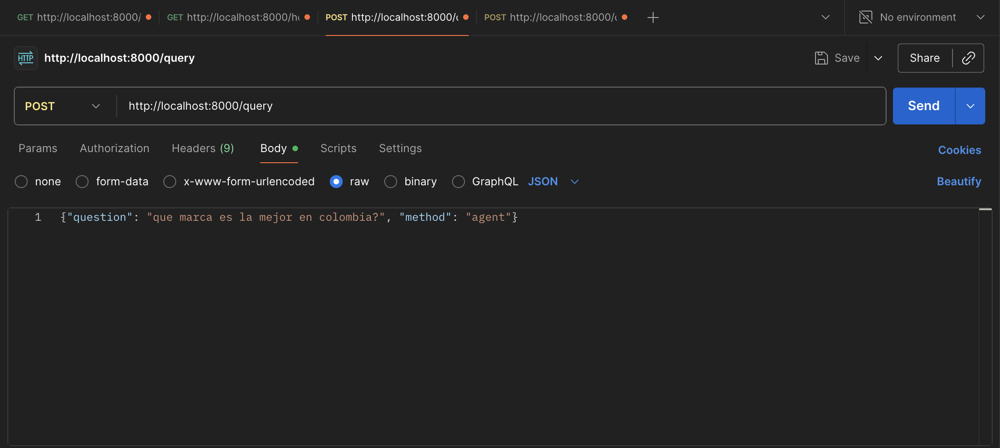

---

## Características

- **Dos Métodos RAG**: Chain (rápido) y Agent (flexible)
- **API REST**: FastAPI con documentación Swagger
- **Ingesta Web**: Carga contenido desde URLs
- **Búsqueda Semántica**: Embeddings con nomic-embed-text
- **Vector Store**: Pinecone para almacenamiento vectorial

---

## Inicio Rápido

### 1. Requisitos Previos

- **Python 3.9+**
- **Cuenta Pinecone** (gratuita disponible)
- **macOS, Linux o Windows**

### 3. Configurar Proyecto

```bash
# Clonar repositorio
git clone https://github.com/juan-beltran0518/ArepRAGProject.git
cd ArepRAGProject

# Crear entorno virtual
python -m venv .venv
source .venv/bin/activate  # En Windows: .venv\Scripts\activate

# Instalar dependencias
pip install -r requirements.txt

# Configurar variables de entorno
cp .env.example .env
```

Editar `.env` y agregar tu API key de Pinecone:

```bash
PINECONE_API_KEY=tu-api-key-aqui
PINECONE_INDEX_NAME=rag-index-ollama
PINECONE_CLOUD=aws
PINECONE_REGION=us-east-1
```

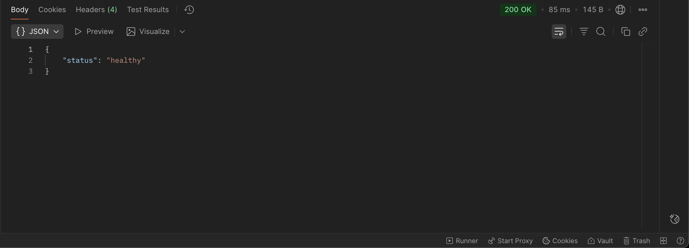

### 4. Ingestar Datos

```bash
python -m src.ingest_web
```

Esto cargará el blog post de Lilian Weng sobre "LLM Powered Autonomous Agents" (~63 chunks).

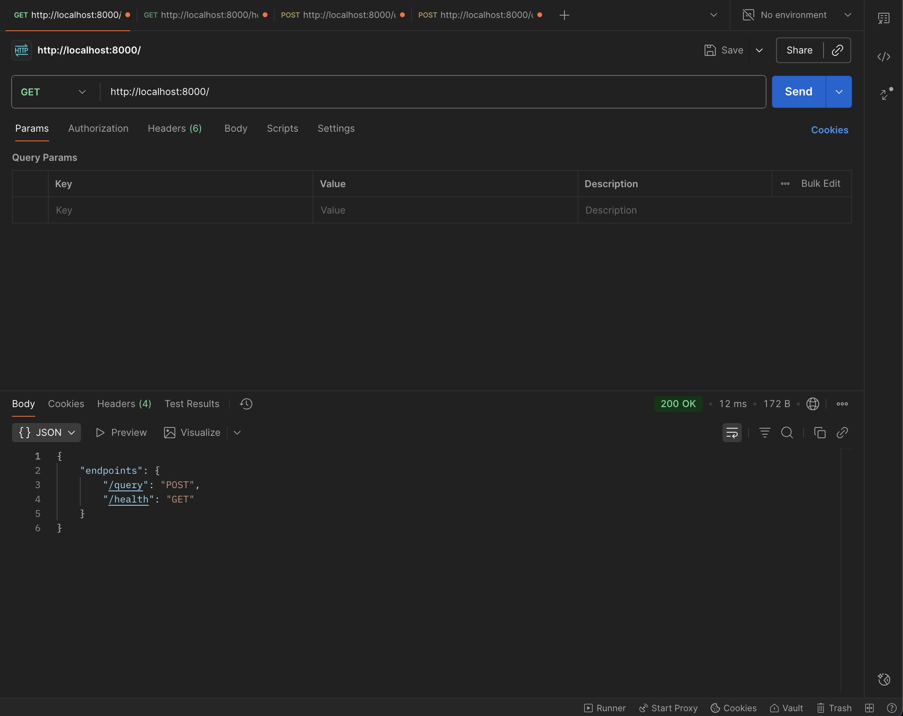

### 5. Probar el Sistema

**CLI - Chain Method (Rápido)**
```bash
python -m src.chain_rag
```

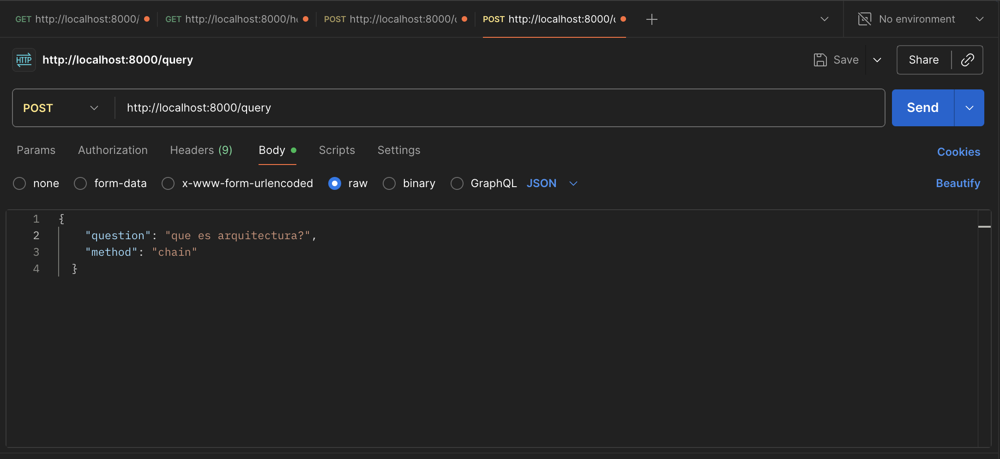

**CLI - Agent Method (Flexible)**
```bash
python -m src.agent_rag
```

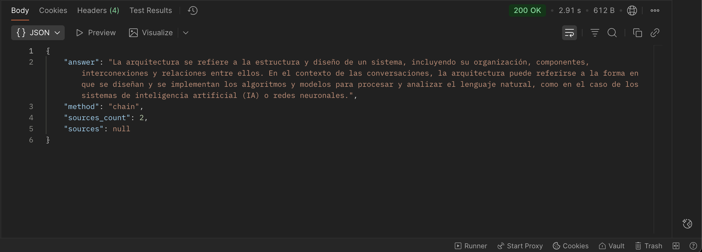

**API REST**
```bash
uvicorn src.app_tutorial:app --host 0.0.0.0 --port 8000
# Swagger UI: http://localhost:8000/docs
```

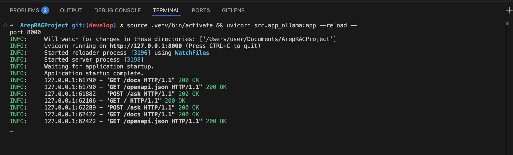

---

## Arquitectura del Sistema

```
                        ┌──────────────────────────────────────┐
                        │         INGESTA DE DATOS             │
                        └──────────────────────────────────────┘
                                        │
                                        ▼
                        ┌──────────────────────────────────────┐
                        │      WebBaseLoader (Beautiful Soup)  │
                        │  https://lilianweng.github.io/...    │
                        └──────────────────────────────────────┘
                                        │
                                        ▼
                        ┌──────────────────────────────────────┐
                        │    RecursiveCharacterTextSplitter    │
                        │       chunk_size=1000, overlap=200   │
                        └──────────────────────────────────────┘
                                        │
                                        ▼
                        ┌──────────────────────────────────────┐
                        │      Ollama Embeddings Model         │
                        │      nomic-embed-text (768 dim)      │
                        └──────────────────────────────────────┘
                                        │
                                        ▼
                        ┌──────────────────────────────────────┐
                        │         Pinecone Vector DB           │
                        │   Index: rag-index-ollama (768 dim)  │
                        │   Namespace: web-blog (63 chunks)    │
                        └──────────────────────────────────────┘


                        ┌──────────────────────────────────────┐
                        │          CONSULTA (QUERY)            │
                        └──────────────────────────────────────┘
                                        │
                        ┌───────────────┴────────────────┐
                        │                                │
                        ▼                                ▼
            ┌─────────────────────┐        ┌─────────────────────┐
            │   CHAIN METHOD      │        │   AGENT METHOD      │
            │   (1 LLM call)      │        │   (2+ LLM calls)    │
            └─────────────────────┘        └─────────────────────┘
                        │                                │
                        └───────────────┬────────────────┘
                                        │
                                        ▼
                        ┌──────────────────────────────────────┐
                        │    Usuario (CLI / API REST)          │
                        └──────────────────────────────────────┘
                                        │
                                        ▼
                        ┌──────────────────────────────────────┐
                        │         FastAPI Application          │
                        │    POST /query, GET /health, etc     │
                        └──────────────────────────────────────┘
                                        │
                        ┌───────────────┴────────────────┐
                        │                                │
                        ▼                                ▼
            ┌─────────────────────┐        ┌─────────────────────┐
            │  create_rag_chain() │        │ create_rag_agent()  │
            │  (chain_rag.py)     │        │  (agent_rag.py)     │
            └─────────────────────┘        └─────────────────────┘
                        │                                │
                        └───────────────┬────────────────┘
                                        │
                                        ▼
                        ┌──────────────────────────────────────┐
                        │    Pinecone Similarity Search        │
                        │    (retrieve top-k documents)        │
                        └──────────────────────────────────────┘
                                        │
                                        ▼
                        ┌──────────────────────────────────────┐
                        │      Ollama Chat Model (LLM)         │
                        │         llama3.2:1b                  │
                        └──────────────────────────────────────┘
                                        │
                                        ▼
                        ┌──────────────────────────────────────┐
                        │         Respuesta Final              │
                        │   (answer + sources + metadata)      │
                        └──────────────────────────────────────┘
```

### Componentes Clave

**1. Ingesta (ingest_web.py)**
- WebBaseLoader carga contenido HTML
- RecursiveCharacterTextSplitter divide en chunks
- OllamaEmbeddings genera vectores (768 dim)
- Pinecone almacena en namespace "web-blog"

**2. Chain RAG (chain_rag.py)**
- Retrieval: Busca documentos relevantes en Pinecone
- Generation: LLM genera respuesta con contexto
- 1 llamada al LLM (rápido y eficiente)

**3. Agent RAG (agent_rag.py)**
- Tool: retrieve_context para búsquedas
- Agent decide cuándo y cómo buscar
- 2+ llamadas al LLM (flexible pero más lento)

**4. API REST (app_tutorial.py)**
- FastAPI con endpoints RESTful
- Soporta ambos métodos (chain/agent)
- CORS habilitado, Swagger UI integrado

---

## Métodos de Consulta

### Chain RAG (Recomendado para consultas simples)

**Características:**
- Más rápido (1 llamada al LLM)
- Devuelve documentos recuperados
- Flujo fijo y predecible

**Uso por CLI:**
```bash
python -m src.chain_rag
```

**Uso programático:**
```python
from src.chain_rag import run_chain_query

answer, docs = run_chain_query("What is task decomposition?")
print(f"Answer: {answer}")
print(f"Sources: {len(docs)} documents")
```

### Agent RAG (Para consultas complejas)

**Características:**
- Más inteligente (usa herramientas)
- Puede hacer múltiples búsquedas
- Mayor flexibilidad

**Uso por CLI:**
```bash
python -m src.agent_rag
```

**Uso programático:**
```python
from src.agent_rag import run_agent_query

answer = run_agent_query("What are the main components of an AI agent?")
print(answer)
```

---

## API REST

### Iniciar Servidor

```bash
# Desarrollo
uvicorn src.app_tutorial:app --reload --port 8000

# Producción (background)
nohup .venv/bin/python -m uvicorn src.app_tutorial:app --host 0.0.0.0 --port 8000 > api.log 2>&1 &
```

### Endpoints Disponibles

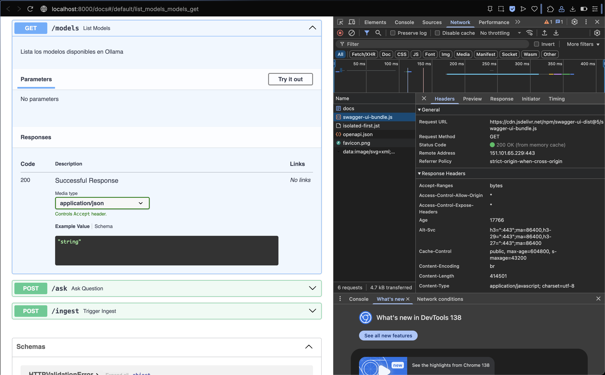

#### 1. **GET /** - Información del API
```bash
curl http://localhost:8000/
```

**Respuesta:**
```json
{
  "endpoints": {
    "/query": "POST",
    "/health": "GET"
  }
}
```

#### 2. **GET /health** - Verificar Estado
```bash
curl http://localhost:8000/health
```

**Respuesta:**
```json
{"status": "healthy"}
```

#### 3. **POST /query** - Realizar Consulta

**Request Body:**
```json
{
  "question": "What is task decomposition?",
  "method": "chain",
  "include_sources": false
}
```

**Parámetros:**
- `question` (string, requerido): La pregunta a responder
- `method` (string, opcional): "chain" o "agent" (default: "chain")
- `include_sources` (boolean, opcional): Incluir documentos fuente (default: false)

**Ejemplo con curl:**
```bash
curl -X POST "http://localhost:8000/query" \
  -H "Content-Type: application/json" \
  -d '{
    "question": "What is task decomposition?",
    "method": "chain",
    "include_sources": true
  }'
```

**Respuesta:**
```json
{
  "answer": "Task decomposition is a technique used to break down complex tasks...",
  "method": "chain",
  "sources_count": 2,
  "sources": [
    {
      "content": "Self-Reflection#\nSelf-reflection is a vital aspect...",
      "metadata": {
        "source": "https://lilianweng.github.io/posts/2023-06-23-agent/",
        "start_index": 3549.0
      }
    }
  ]
}
```

#### 4. **POST /ingest** - Reingestar Datos
  }
```

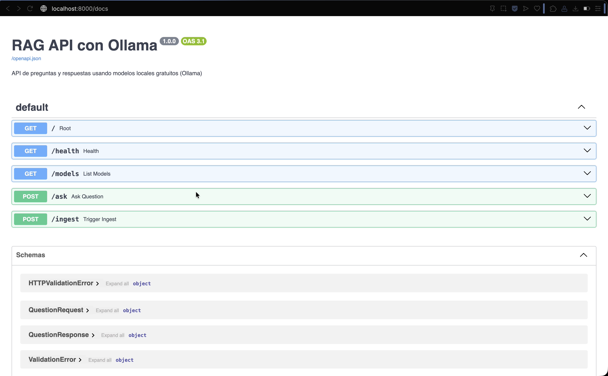

#### 4. **POST /ingest** - Reingestar Datos

**Respuesta:**
```json
{"status": "started"}
```

### Colección de Postman

Importa `RAG_API.postman_collection.json` en Postman para tener todos los endpoints pre-configurados.

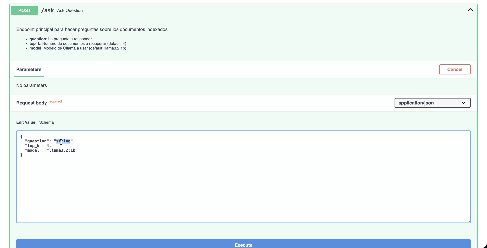

---

## Comparación de Métodos

### RAG Chain vs RAG Agent

| Característica | RAG Chain | RAG Agent |
|----------------|-----------|-----------|
| **Velocidad** | Muy rápido | Moderado |
| **Llamadas LLM** | 1 | 2+ |
| **Flexibilidad** | Baja | Alta |
| **Control** | Alto | Medio |
| **Búsquedas** | 1 fija | Múltiples iterativas |
| **Mejor para** | Preguntas directas | Consultas complejas |
| **Complejidad** | Simple | Avanzada |

### Cuándo Usar Cada Método

**Usa Chain cuando:**
- Necesitas respuestas rápidas
- La pregunta es directa
- Quieres control total del flujo
- Necesitas los documentos recuperados

**Usa Agent cuando:**
- La pregunta requiere razonamiento
- Necesitas búsquedas iterativas
- Quieres que el LLM decida la estrategia
- La consulta es multi-paso


---

## Estructura del Proyecto

```
ArepRAGProject/
├── src/
│   ├── agent_rag.py          # RAG con agente (109 líneas)
│   ├── chain_rag.py          # RAG con chain (63 líneas)
│   ├── ingest_web.py         # Ingesta web (46 líneas)
│   ├── app_tutorial.py       # API REST (86 líneas)
│   └── settings.py           # Configuración (12 líneas)
│
├── .env                      # Variables de entorno
├── .env.example              # Template de configuración
├── requirements.txt          # Dependencias
├── README.md                 # Documentación
├── API_EXAMPLES.md           # Ejemplos de API
└── RAG_API.postman_collection.json  # Colección Postman
```

### Descripción de Archivos

**agent_rag.py**
- Implementa RAG con agente y herramientas
- Incluye fallback si AgentExecutor no disponible
- Función principal: `run_agent_query(question)`

**chain_rag.py**
- Implementa RAG con chain de 2 pasos
- Flujo: recuperación → generación
- Función principal: `run_chain_query(question)`

**ingest_web.py**
- Carga contenido desde URL (Lilian Weng blog)
- Usa WebBaseLoader + BeautifulSoup
- Indexa ~63 chunks en Pinecone

**app_tutorial.py**
- API REST con FastAPI
- Endpoints: /, /health, /query, /ingest
- Soporta métodos chain y agent

**settings.py**
- Configuración con Pydantic
- Variables: Pinecone API, índice, región

---

## Ejemplos

### Ejemplo 1: Consulta Básica (CLI)

```bash
$ python -m src.chain_rag

Question: What is task decomposition?

Retrieved 2 documents:
  [1] Source: https://lilianweng.github.io/posts/2023-06-23-agent/
  [2] Source: https://lilianweng.github.io/posts/2023-06-23-agent/

Answer:
Task decomposition is a technique used to break down complex tasks into 
smaller, more manageable steps. It involves identifying the individual 
components or subtasks that need to be completed to achieve the overall 
goal of the task...
```

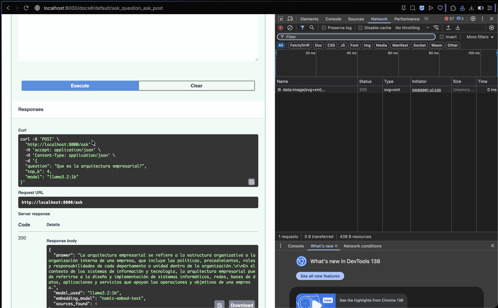

### Ejemplo 2: Consulta con Fuentes (API)

```python
import requests

response = requests.post(
    "http://localhost:8000/query",
    json={
        "question": "What is self-reflection in AI agents?",
        "method": "chain",
        "include_sources": True
    }
)

data = response.json()
print(f"Answer: {data['answer']}")
print(f"Sources: {data['sources_count']}")

for i, source in enumerate(data['sources'], 1):
    print(f"\n[{i}] {source['metadata']['source']}")
    print(f"    {source['content'][:100]}...")
```

### Ejemplo 3: Uso Avanzado con Agent

```python
from src.agent_rag import run_agent_query

# Consulta compleja que requiere razonamiento
query = """
What is the standard method for Task Decomposition?
Once you get the answer, look up common extensions of that method.
"""

answer = run_agent_query(query)
print(answer)
```

### Ejemplo 4: Batch Processing

```python
from src.chain_rag import run_chain_query

questions = [
    "What is task decomposition?",
    "What are common ways of doing it?",
    "What is self-reflection in AI agents?"
]

for q in questions:
    answer, docs = run_chain_query(q)
    print(f"\nQ: {q}")
    print(f"A: {answer[:200]}...")
    print(f"Sources: {len(docs)}")
```


---

## Troubleshooting

### Error: "Connection error to Ollama"

**Causa**: Ollama no está corriendo

**Solución**:
```bash
brew services start ollama
# Verificar: curl http://localhost:11434
```

### Error: "Model not found"

**Causa**: Modelos no descargados

**Solución**:
```bash
ollama pull nomic-embed-text
ollama pull llama3.2:1b
ollama list  # Verificar instalados
```

### Error: "Index not found in Pinecone"

**Causa**: No se ha ejecutado la ingesta

**Solución**:
```bash
python -m src.ingest_web
```

### Error: "ValidationError on Settings"

**Causa**: Variables de entorno mal configuradas

**Solución**:
```bash
# Verificar que .env contiene solo:
PINECONE_API_KEY=tu-key
PINECONE_INDEX_NAME=rag-index-ollama
PINECONE_CLOUD=aws
PINECONE_REGION=us-east-1
```

### Error: "Port 8000 already in use"

**Causa**: Otro proceso está usando el puerto

**Solución**:
```bash
# Liberar puerto
lsof -ti:8000 | xargs kill -9

# O usar otro puerto
uvicorn src.app_tutorial:app --port 8001
```

---

## Documentación Adicional

- **[API_EXAMPLES.md](API_EXAMPLES.md)** - Guía completa de ejemplos de API con curl
- **[RAG_API.postman_collection.json](RAG_API.postman_collection.json)** - Colección Postman lista para importar
- **[Tutorial LangChain](https://python.langchain.com/docs/tutorials/rag/)** - Tutorial oficial usado como base
- **[Swagger UI](http://localhost:8000/docs)** - Documentación interactiva (requiere servidor corriendo)

---

## Configuración Avanzada

### Cambiar Modelo LLM

En `chain_rag.py` o `agent_rag.py`:

```python
llm = ChatOllama(
    model="llama3.2:3b",  # Cambiar modelo
    temperature=0.7        # Ajustar creatividad
)
```

**Modelos Ollama disponibles:**
- `llama3.2:1b` - Rápido (1B parámetros)
- `llama3.2:3b` - Balanceado (3B parámetros)
- `llama3.1:8b` - Alta calidad (8B parámetros)

### Ajustar Recuperación de Documentos

En `chain_rag.py`:

```python
retriever = vs.as_retriever(
    search_kwargs={"k": 6}  # Default: 4
)
```

### Configurar Namespace Pinecone

En `.env`:

```bash
PINECONE_NAMESPACE="mi-namespace"
```

---

## Tecnologías Utilizadas

- **Python 3.9+**: Lenguaje base
- **LangChain 0.3+**: Framework RAG
- **Ollama**: Modelos locales (llama3.2:1b, nomic-embed-text)
- **Pinecone**: Vector database (768 dim, cosine)
- **FastAPI 0.115+**: Framework API REST
- **BeautifulSoup4**: Web scraping
- **Pydantic**: Validación de configuración

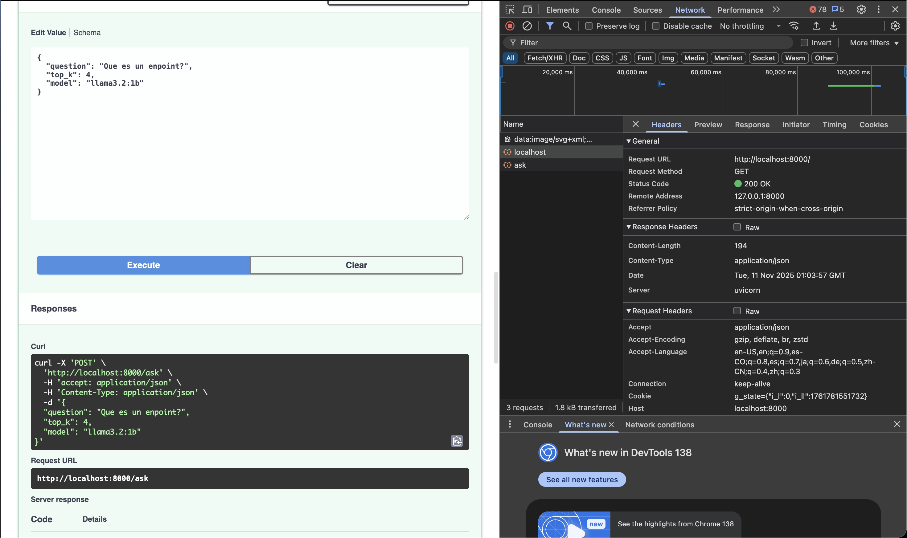

---


